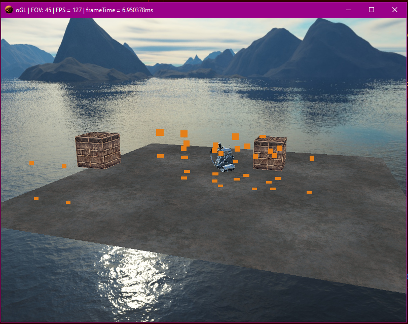

# Simple _hopefully PBR_ openGL renderer



This is following the guidance of [learnopengl](https://learnopengl.com/).

## Tech:
- [GLFW](https://www.glfw.org/documentation.html) as window creation and openGL interface
- [GLAD](https://glad.dav1d.de/) as a managment system, simplifying openGL featuresets
- [stb](https://github.com/nothings/stb/blob/master/stb_image.h) image format library
- [glm](http://glm.g-truc.net/0.9.8/index.html) openGL focused mathematics library
- [VS Code](https://code.visualstudio.com/) is being used as the IDE
- [mingw32](https://www.msys2.org/) g++ and gdb provided via mingw from msys
- [git](https://git-scm.com/) VCS using git within VS Code

## Goals:
- [x] Load openGL
- [ ] Load models
- [ ] Lighting
- [ ] Shadows
- [ ] PBR materials

## Setup:
### VS Code
Currently, I am compiling this code in the VS Code IDE, with mingw suppling g++. Below is the arguments in tasks.json:
```JSON
"args": [
    "-fdiagnostics-color=always",
    "-g",
    "${file}",
    "..\\include\\glad.c",
    "-lglfw3","-lgdi32","-lopengl32","-luser32","-lkernel32",
    "-IS:\\Mutual\\Code\\C++\\Libraries\\glfw-3.3.8\\include",
    "-IS:\\Mutual\\Code\\C++\\Libraries\\glad\\include",
    "-IS:\\Mutual\\Code\\C++\\Libraries\\glm",
    "-IS:\\Mutual\\Code\\C++\\oGL\\include",
    "-LS:\\Mutual\\Code\\C++\\Libraries\\glfw-3.3.8\\build\\src",
    "-o",
    "${fileDirname}\\${fileBasenameNoExtension}.exe"
],
```
For intellisense, my c_cpp_properties.json has:
```JSON
"includePath": [
    "${workspaceFolder}/**",
    "S:\\Mutual\\Code\\C++\\Libraries\\glfw-3.3.8\\include",
    "S:\\Mutual\\Code\\C++\\Libraries\\glad\\include",
    "S:\\Mutual\\Code\\C++\\Libraries\\glm\\**"
],
```
### GLFW
GLFW was built using its supplied CMAKE config. The library is then statically compiled into this project. If changing to dynamic linking, or chaging the includes, be aware that GLFW requires specific ```#define``` statements, and ordering of ```#include``` lines.
### GLAD
Glad is customised via their website. A ```glad.c``` file is then to be built into the project.
### STB
This header library is downloaded, then included into ```main.cpp```.
### GLM
Another larger library. Downloaded, and then linked to for g++ to find at compile time.