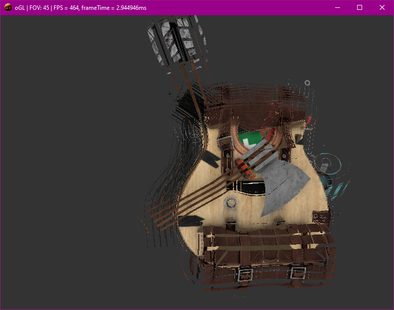

# Simple _hopefully PBR_ openGL renderer

This is following the guidance of [learnopengl](https://learnopengl.com/).

## Tech:
- [GLFW](https://www.glfw.org/documentation.html) as window creation and openGL interface
- [GLAD](https://glad.dav1d.de/) as a managment system, simplifying openGL featuresets
- [stb](https://github.com/nothings/stb/blob/master/stb_image.h) image format library
- [VS Code](https://code.visualstudio.com/) is being used as the IDE
- [mingw32](https://www.msys2.org/) g++ and gdb provided via mingw from msys
- [git](https://git-scm.com/) VCS using git within VS Code

## Goals:
- [x] Load openGL
- [ ] Load models
- [ ] Lighting
- [ ] Shadows
- [ ] PBR materials